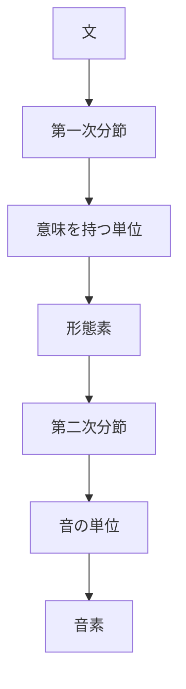

<!-- markdownlint-disable MD003 MD012 MD013 MD022 MD024 MD025 MD033 -->

---
layout: cover
---

# 言語学
第1週
<!---->
<!-- ### 言語学の基礎と音韻論 -->

2026年1月12日（月）2-3限

---
layout: top-title-two-cols
color: navy
---

:: title ::

# キーワード

:: left ::

 
1. **言語学** : 言語の科学的研究
2. **記号の恣意性** : 音と意味の結びつきに必然性がないこと
3. **二重分節** : 音韻と形態の二段階構造
4. **音素** : 意味の違いをもたらす最小の音の単位
5. **異音** : 同じ音素の異なる実現形
6. **弁別的特徴** : 音素を区別する音声的性質

:: right ::

7. **音韻規則** : 音素の変化を記述する規則
8. **最小対** : 一つの音素だけが異なる語の組
9. **相補分布** : 異音が現れる環境が重ならないこと
10. **自由変異** : 同じ環境で交換可能な音の違い
11. **音節** : 発音の最小単位
12. **モーラ** : 日本語のリズムの単位（拍）

<!-- これはプレゼンターノートです -->

---
layout: top-title-two-cols
color: navy
---

:: title ::

# 言語学

:: left ::

## 言語学の定義

言語を科学的・体系的に研究する学問

## 言語学と語学の違い

**言語学（Linguistics）**

- 言語の仕組みを研究
- 理論的・分析的
- 例：「日本語の文法構造」

**語学（Language Learning）**

- 言語の使用を学習
- 実践的・技能的
- 例：「日本語会話の習得」

:: right ::

 

### 言語聴覚士に必要な理由
- 言語障害の理解には言語の構造理解が不可欠
- 評価・訓練の理論的基盤となる

---
layout: default
---

# 2. 言語記号の特性

### ソシュールの言語観

#### 記号の恣意性（Arbitrariness）
- 音と意味の結びつきに必然性がない
- 例：「犬」= /inu/ (日本語) = /dog/ (英語)
- 同じ意味でも言語によって音形が異なる

#### 線状性（Linearity）
- 音声は時間軸上に一次元的に配列される
- 同時に複数の語を発音できない
- 文は一定の順序で配列される

### 重要ポイント 📌
記号の恣意性は、言語が**社会的な約束事**であることを示す。言語障害の評価でも、この原理の理解が基礎となる。

---
layout: default
---

# 3. 二重分節

### 言語の経済性を支える仕組み

### 第一次分節（形態的分節）
- 意味を持つ最小単位に分ける
- 例：「読まない」→「読ま」+「ない」
- 形態素レベルの分割

### 第二次分節（音韻的分節）
- 意味を持たない音の単位に分ける
- 例：「ネコ」→ /n/ + /e/ + /k/ + /o/
- 音素レベルの分割

---
layout: default
---

# 4. 音素（Phoneme）

### 音素の定義
意味の違いをもたらす**最小の音の単位**

### 音素を見つける方法：最小対（Minimal Pair）

#### 日本語の例
- **「サカナ」vs「タカナ」**
  - /s/ と /t/ は異なる音素
- **「カキ」vs「カギ」**
  - /k/ と /g/ は異なる音素
- **「ハシ（橋）」vs「ハシ（箸）」**
  - アクセントも音韻的要素

#### 英語の例
- **"bat" vs "pat"**
  - /b/ と /p/ は異なる音素
- **"ship" vs "sheep"**
  - /ɪ/ と /iː/ は異なる音素

---
layout: default
---

# 5. 異音（Allophone）

### 異音の定義
同じ音素の**異なる音声的実現形**

### 相補分布（Complementary Distribution）
異音が現れる環境が重ならない

#### 例：日本語の/g/
- **語頭** → [g]（破裂音）：「学校」[gakkoː]
- **語中** → [ŋ]（鼻音）：「新聞」[ɕiɱbuɴ]

これらは**相補分布**にあるため、同一音素の異音

### 自由変異（Free Variation）
同じ環境で交換可能な音の違い
- 例：「数学」の「す」→ [sɯ] または [sɯ̥]（無声化）

---
layout: default
---

# 6. 弁別的特徴

### 音素を区別する音声的性質

| 特徴 | 例：日本語 | 対立 |
|------|-----------|------|
| **声帯振動** | /k/ vs /g/ | 無声 vs 有声 |
| **調音位置** | /t/ vs /k/ | 歯茎 vs 軟口蓋 |
| **調音方法** | /t/ vs /s/ | 破裂 vs 摩擦 |
| **鼻音性** | /m/ vs /b/ | 鼻音 vs 口音 |

### 重要ポイント 📌
言語によって弁別的な特徴が異なる
- 日本語：長音の有無（「おばさん」vs「おばあさん」）
- 英語：気音の有無は弁別的ではない

---
layout: default
---

# 7. 音韻規則

### 音素の体系的な変化を記述

#### 同化（Assimilation）
隣接する音の影響で音が変化
- **順行同化**：「新聞」/siɱbun/ → [ɕiɱbuɴ]
  - /n/が後続の/b/の影響で[m]に
- **逆行同化**：「三本」/sanboɴ/ → [samboɴ]
  - /n/が後続の/b/の影響で[m]に

#### 異化（Dissimilation）
連続する類似音が異なる音に変化

#### 脱落（Deletion）
特定の環境で音が消失
- 「です」[des] （/u/の脱落）

#### 挿入（Insertion）
音の追加
- 「雰囲気」→「ふいんき」（/n/の挿入）

---
layout: top-title-two-cols
---

:: title ::

# 8. 音節とモーラ

:: left ::

### 音節（Syllable）
発音の自然な単位

#### 日本語の音節構造
- **(C)V(C)**
  - C = 子音、V = 母音
- 例：「桜」= /sa.ku.ra/（3音節）

#### 音節の構成
- **頭子音**：音節の始まり
- **核（母音）**：音節の中心
- **尾子音**：音節の終わり

:: right ::

### モーラ（拍）
日本語のリズムの単位

#### 特徴
- 時間的に等しい長さ
- 日本語：モーラ言語
- 英語：強勢言語

#### 例：「学校」
- 音節：ga.k.koː（2音節）
- モーラ：が・っ・こ・う（4モーラ）

### 臨床への応用 🏥
モーラの理解は、吃音や音韻障害の評価で重要

---
layout: section
color: amber
---

# 休憩

### 後半は口頭試問で知識を定着させます

---
layout: default
---

# 口頭試問の進め方

### 形式
1. スライドに問題を1問ずつ提示
2. ランダムに指名して口頭で回答
3. 即座に解説とフィードバック
4. 全員が複数回答える機会を確保

### 回答のポイント
- 考える時間：30秒程度
- わからない場合は「わかりません」と正直に
- 間違いから学ぶことが重要

---
layout: default
---

# 問題1：基礎概念

### 次のうち、**記号の恣意性**の説明として正しいものはどれか。

1. 音と意味の結びつきには必然性がある
2. 音と意味の結びつきには必然性がない
3. すべての言語で同じ音は同じ意味を持つ
4. 音声記号は世界共通である
5. 言語は本能的に獲得される

---
layout: default
color: green
---

# 問題1：解答と解説

### 正解：2

#### 解説
**記号の恣意性**とは、言語記号（音と意味の結びつき）が恣意的（arbitrary）であり、必然性がないという原理。

- 同じ意味でも言語によって異なる音形を持つ
  - 「犬」= /inu/（日本語）、/dog/（英語）、/chien/（フランス語）
- これは言語が**社会的な約束事**であることを示す
- ソシュールが提唱した言語学の基本原理

#### よくある誤解
擬音語（オノマトペ）は音と意味に関連があるように見えるが、これも言語によって異なる（日本語「ワンワン」vs 英語「bow-wow」）

---
layout: default
---

# 問題2：二重分節

### 「話せない」という語を二重分節の観点から分析した場合、第一次分節（形態的分節）の結果として最も適切なものはどれか。

1. /h/ + /a/ + /n/ + /a/ + /s/ + /e/ + /n/ + /a/ + /i/
2. 話 + せ + ない
3. 話せ + ない
4. 話 + せない
5. 分節できない

---
layout: default
color: green
---

# 問題2：解答と解説

### 正解：3

#### 解説
- **第一次分節（形態的分節）**：意味を持つ最小単位（形態素）に分割
  - 「話せない」→「話せ」+「ない」
  - 「話せ」= 動詞語幹「話」+ 可能の助動詞「せ（られ）」の連用形
  - 「ない」= 否定の助動詞

- **第二次分節（音韻的分節）**：意味を持たない音の単位（音素）に分割
  - 「話せない」→ /h/ + /a/ + /n/ + /a/ + /s/ + /e/ + /n/ + /a/ + /i/

#### 重要ポイント
二重分節により、少数の音素で無数の意味を表現できる（言語の経済性）

---
layout: default
---

# 問題3：音素と異音

### 次のうち、日本語における**最小対（minimal pair）**の例として正しいものはどれか。

1. 「橋」と「箸」
2. 「雨」と「飴」
3. 「サカナ」と「タカナ」
4. 「カキ」と「カギ」
5. 上記すべて

---
layout: default
color: green
---

# 問題3：解答と解説

### 正解：5（すべて正しい）

#### 解説
**最小対**とは、一つの音素（または韻律的要素）だけが異なる語の組

1. 「橋」[haꜜshi] と「箸」[haꜜshi]
   - アクセントの違い（韻律も音韻的要素）

2. 「雨」[aꜜme] と「飴」[ame]
   - アクセントの違い

3. 「サカナ」/sakana/ と「タカナ」/takana/
   - 音素 /s/ と /t/ の対立

4. 「カキ」/kaki/ と「カギ」/kagi/
   - 音素 /k/ と /g/ の対立（無声 vs 有声）

---
layout: default
---

# 問題4：相補分布

### 日本語の「ガ行」の子音 /g/ について、次のうち正しい説明はどれか。

1. すべての位置で常に破裂音[g]として発音される
2. 語頭では破裂音[g]、語中では鼻音[ŋ]となることがある
3. 語頭でも語中でも常に鼻音[ŋ]として発音される
4. /g/と/ŋ/は日本語で異なる音素である
5. 位置による発音の違いはない

---
layout: default
color: green
---

# 問題4：解答と解説

### 正解：2

#### 解説
日本語の /g/ は**相補分布**にある異音を持つ：

- **語頭**：破裂音 [g]
  - 例：「学校」[gakkoː]、「元気」[geŋki]

- **語中**：鼻音 [ŋ]（鼻濁音）
  - 例：「新聞」[ɕiɱbuɴ]、「日本語」[nihoŋɡo]

#### 重要ポイント
- 相補分布 = 異音が現れる環境が重ならない
- [g]と[ŋ]は同一音素 /g/ の異音
- ただし、現代日本語では鼻濁音の使用が減少傾向

---
layout: default
---

# 問題5：音韻規則

### 「新聞」という語が[ɕiɱbuɴ]のように発音される現象を説明する音韻規則として正しいものはどれか。

1. 異化
2. 同化
3. 脱落
4. 挿入
5. メタセシス（音位転換）

---
layout: default
color: green
---

# 問題5：解答と解説

### 正解：2（同化）

#### 解説
「新聞」/siɱbuɴ/ → [ɕiɱbuɴ]

- **/n/ → [m]** の変化
- これは後続の /b/（両唇音）の影響
- /n/（歯茎鼻音）が [m]（両唇鼻音）に変化
- **逆行同化**の一例（後続音の影響を受ける）

#### 同化の種類
- **順行同化**：前の音の影響を受ける
- **逆行同化**：後ろの音の影響を受ける
- **相互同化**：双方向の影響

---
layout: default
---

# 問題6：音節とモーラ

### 「学校」という語の音節数とモーラ数の組み合わせとして正しいものはどれか。

1. 音節2、モーラ2
2. 音節2、モーラ3
3. 音節2、モーラ4
4. 音節3、モーラ4
5. 音節4、モーラ4

---
layout: default
color: green
---

# 問題6：解答と解説

### 正解：3

#### 解説
「学校」/gakkoː/

**音節数**：2音節
- gak（第1音節）
- koː（第2音節）

**モーラ数**：4モーラ
- が（1モーラ）
- っ（1モーラ）= 促音
- こ（1モーラ）
- う（1モーラ）= 長音

#### 重要ポイント
- 促音「っ」、長音「ー」、撥音「ん」はそれぞれ1モーラ
- 日本語はモーラ言語（各モーラが等時性を持つ）

---
layout: default
---

# 追加演習問題

### ※ここに実際の国家試験過去問を追加してください

#### 準備事項
1. 厚生労働省または試験実施機関から過去問を入手
2. 言語学（音韻論）に関する問題を抽出
3. 問題番号、出題回、選択肢をこのスライドに追加

#### 推奨する過去問の範囲
- 第20回〜第27回言語聴覚士国家試験
- 音韻論、音素、異音に関する問題
- 音韻規則に関する問題

---
layout: top-title
---

:: title ::

# 本日のまとめ

:: content ::

### 確認：今日覚えたキーワード12個

1. ✅ 言語学
2. ✅ 記号の恣意性
3. ✅ 二重分節
4. ✅ 音素
5. ✅ 異音
6. ✅ 弁別的特徴
7. ✅ 音韻規則
8. ✅ 最小対
9. ✅ 相補分布
10. ✅ 自由変異
11. ✅ 音節
12. ✅ モーラ

### 次週の予告
**第2週（1/20）：形態論**
- 形態素の種類
- 語形成（派生・複合）
- 品詞の分類

---
layout: end
---

# お疲れ様でした

### 復習のポイント
- 今日のキーワード12個を声に出して復習
- 最小対の例を自分で考えてみる
- 日常の言葉で音韻規則を観察する

次週もよろしくお願いします。
