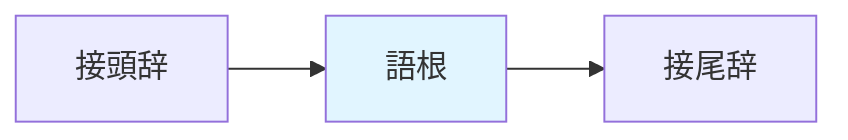

<!-- markdownlint-disable MD003 MD012 MD013 MD022 MD024 MD025 MD033 -->

---
layout: cover
---

# 言語聴覚士国家試験対策
## 言語学 第2週

### 形態論

2025年1月20日（月）2-3限

---
layout: top-title
color: sky
---

:: title ::

# 本日の目標

:: content ::

### 今日覚えるべきキーワード（15個）

1. **形態論** - 語の構造を研究する分野
2. **形態素** - 意味を持つ最小単位
3. **自由形態素** - 単独で使用できる形態素
4. **拘束形態素** - 単独で使用できない形態素
5. **語根** - 語の中核的意味を担う部分
6. **接辞** - 語根に付加される形態素
7. **接頭辞** - 語根の前に付く接辞
8. **接尾辞** - 語根の後ろに付く接辞
9. **屈折** - 文法的機能を表す形態変化
10. **派生** - 新しい語を作る形態変化
11. **複合** - 複数の語根を組み合わせる
12. **活用** - 動詞・形容詞の形態変化
13. **語彙的形態素** - 実質的意味を持つ
14. **文法的形態素** - 文法的機能を持つ
15. **異形態** - 同じ形態素の異なる形

---
layout: default
---

# 1. 形態論とは

### 形態論（Morphology）の定義
語（word）の内部構造と形成過程を研究する言語学の分野

### 研究対象
- 形態素の種類と機能
- 語形成の規則
- 語の内部構造
- 形態変化のパターン

### 臨床との関連
- **失語症**：形態素レベルの障害
- **言語発達障害**：語形成の遅れ
- **読み書き障害**：形態素認識
- 評価・訓練の理論的基盤

---
layout: default
---

# 2. 形態素（Morpheme）

### 形態素の定義
**意味を持つ最小の言語単位**

### 例：「読まない」の分析
```
読まない ＝ 読ま + ない
```
- 「読ま」：動詞語幹（意味：read）
- 「ない」：否定の助動詞（意味：not）

### 形態素 vs 音素
- **音素**：意味を持たない音の単位（/n/, /a/, /i/）
- **形態素**：意味を持つ最小単位（「読ま」「ない」）

---
layout: top-title-two-cols
---

:: title ::

# 3. 形態素の分類（1）

:: left ::

### 自由形態素 vs 拘束形態素

**自由形態素**（Free Morpheme）
- 単独で使用可能
- 例：
  - 「本」
  - 「読む」
  - 「赤い」

:: right ::

<br><br>

**拘束形態素**（Bound Morpheme）
- 必ず他の形態素と結合
- 例：
  - 「-た」（過去）
  - 「-ない」（否定）
  - 「お-」（接頭辞）
  - 「-さ」（名詞化）

---
layout: default
---

# 3. 形態素の分類（2）

### 語彙的形態素 vs 文法的形態素

#### 語彙的形態素（Lexical M.）
実質的な意味内容を持つ

**例：**
- 名詞：「本」「学校」
- 動詞：「読む」「走る」
- 形容詞：「赤い」「大きい」
- 副詞：「ゆっくり」

→ **内容語**（content words）

#### 文法的形態素（Grammatical M.）
文法的機能を表す

**例：**
- 助詞：「が」「を」「に」
- 助動詞：「れる」「た」「ない」
- 接辞：「お-」「-さ」

→ **機能語**（function words）

### 重要ポイント 📌
失語症では、文法的形態素が選択的に障害されることがある（ブローカ失語など）

---
layout: default
---

# 4. 接辞（Affix）

### 接辞の種類と位置



### 接頭辞（Prefix）
語根の**前**に付く

**日本語の例：**
- お-：「お花」「お茶」（美化）
- 不-：「不可能」「不安」（否定）
- 再-：「再開」「再発」（反復）

### 接尾辞（Suffix）
語根の**後ろ**に付く

**日本語の例：**
- -的：「科学的」（形容動詞化）
- -さ：「暗さ」「高さ」（名詞化）
- -化：「国際化」（名詞化）

---
layout: top-title-two-cols
---

:: title ::

# 5. 屈折 vs 派生

:: left ::

### 屈折（Inflection）
文法的機能を表す形態変化
- **品詞は変わらない**
- 統語的関係を示す

#### 日本語の例
- 動詞の活用
  - 「読む」→「読んだ」（過去）
  - 「読む」→「読まない」（否定）
- 形容詞の活用
  - 「高い」→「高かった」
  - 「高い」→「高く」

:: right ::

### 派生（Derivation）
新しい語を作る形態変化
- **品詞が変わることが多い**
- 語彙を拡大

#### 日本語の例
- 名詞化
  - 「暗い」→「暗さ」
  - 「走る」→「走り」
- 動詞化
  - 「安定」→「安定する」
- 形容詞化
  - 「科学」→「科学的」

---
layout: default
---

# 6. 日本語の活用

### 動詞の活用形

| 活用形 | 例（書く） | 用法 |
|--------|-----------|------|
| **未然形** | 書か | 「書か**ない**」（否定） |
| **連用形** | 書き | 「書き**ます**」（丁寧） |
| **終止形** | 書く | 「書く。」（文末） |
| **連体形** | 書く | 「書く**人**」（名詞修飾） |
| **仮定形** | 書け | 「書け**ば**」（条件） |
| **命令形** | 書け | 「書け！」（命令） |

### 動詞の活用の種類
- **五段活用**：「書く」「読む」「走る」
- **一段活用**：「見る」「食べる」
- **カ変**：「来る」
- **サ変**：「する」

---
layout: default
---

# 7. 複合語

### 複合語（Compound）の定義
複数の**語根**を組み合わせて作る語

### 複合名詞
- **名詞 + 名詞**
  - 「雨水」= 雨 + 水
  - 「本棚」= 本 + 棚
  - 「新聞紙」= 新聞 + 紙

### 複合動詞
- **動詞 + 動詞**
  - 「立ち上がる」= 立つ + 上がる
  - 「走り出す」= 走る + 出す
  - 「読み終える」= 読む + 終える

### 複合形容詞
- **形容詞語幹 + 形容詞**
  - 「青白い」= 青 + 白い
  - 「薄暗い」= 薄 + 暗い

### 複合の特徴
- 連濁：「本棚」[hon-dana]
- アクセント変化
- 意味の特殊化

---
layout: default
---

# 8. 異形態（Allomorph）

### 異形態の定義
同じ形態素の**異なる音韻的実現形**

### 日本語の例

#### 否定の助動詞
- 「-ない」：書か**ない**
- 「-ん」：書か**ん**
- 「-ぬ」：知ら**ぬ**

→ 同じ意味（否定）の異形態

#### 複数の接頭辞「お-」
- 「お-」：お茶、お花
- 「御-」：御飯

→ 環境や語種によって選択

### 英語の例
- 複数形：**-s** [s] (cats)、**-s** [z] (dogs)、**-es** [ɪz] (buses)

---
layout: default
---

# 9. 語形成のプロセス

### 主な語形成方法

| 方法 | 説明 | 例 |
|------|------|-----|
| **派生** | 接辞による | 暗い → 暗**さ** |
| **複合** | 語根の結合 | 本 + 棚 → 本棚 |
| **転換** | 品詞の変更 | 走る（動）→ 走り（名） |
| **短縮** | 語の省略 | パーソナルコンピュータ → パソコン |
| **混成** | 語の一部を結合 | スモッグ（smoke + fog） |
| **頭字語** | 頭文字の組み合わせ | WHO、NATO |

---
layout: section
color: amber
---

# 休憩

### 後半は口頭試問で知識を定着させます

---
layout: default
---

# 問題1：形態素の分析

### 「読まなかった」を形態素に分割した場合、正しいものはどれか。

1. 読ま / なかった
2. 読 / ま / な / かった
3. 読ま / な / かった
4. 読 / ま / ない / た
5. 読ま / ない / た

---
layout: default
color: green
---

# 問題1：解答と解説

### 正解：3

#### 解説
「読まなかった」の形態素分析：

```
読ま + な + かっ + た
```

- **読ま**：動詞語幹「読む」の未然形
- **な**：否定の助動詞「ない」の語幹
- **かっ**：過去の助動詞「た」の連用形（「なかった」として）
- **た**：過去の助動詞

#### より単純化した分析
```
読ま + なかった
```
- 「なかった」を一つの形態素（否定過去）と見ることもできる

---
layout: default
---

# 問題2：自由形態素と拘束形態素

### 次のうち、**拘束形態素**のみで構成されているものはどれか。

1. 「本を読む」
2. 「走った」の「-た」
3. 「お花」の「お-」
4. 「読まない」の「-ない」
5. 2、3、4すべて

---
layout: default
color: green
---

# 問題2：解答と解説

### 正解：5

#### 解説
**拘束形態素**は単独で使用できない形態素

- **2. 「-た」**
  - 過去を表す助動詞
  - 必ず動詞に付く
  
- **3. 「お-」**
  - 美化の接頭辞
  - 必ず名詞に付く
  
- **4. 「-ない」**
  - 否定の助動詞
  - 必ず動詞に付く

#### 自由形態素の例
「本」「走る」「読む」など、単独で使用可能

---
layout: default
---

# 問題3：語彙的形態素と文法的形態素

### 失語症（特にブローカ失語）で障害されやすいのはどちらか。

1. 語彙的形態素（名詞、動詞など）
2. 文法的形態素（助詞、助動詞など）
3. 両方とも同程度に障害される
4. どちらも障害されない
5. 個人差が大きく一概に言えない

---
layout: default
color: green
---

# 問題3：解答と解説

### 正解：2

#### 解説
ブローカ失語の特徴的な言語症状：

- **文法的形態素の障害**
  - 助詞の脱落：「私**が**本**を**読む」→「私 本 読む」
  - 助動詞の脱落：「読ん**だ**」→「読む」
  - 接辞の誤り

- **語彙的形態素は比較的保たれる**
  - 名詞、動詞などの実質語は産出可能
  - ただし、活用形の誤りは見られる

#### 臨床的意義
この選択的障害は、脳内で語彙処理と文法処理が異なる機構であることを示唆

---
layout: default
---

# 問題4：屈折と派生

### 次のうち、**派生**による語形成の例はどれか。

1. 「読む」→「読んだ」
2. 「高い」→「高かった」
3. 「暗い」→「暗さ」
4. 「走る」→「走れば」
5. 「書く」→「書きます」

---
layout: default
color: green
---

# 問題4：解答と解説

### 正解：3

#### 解説

**派生**（新しい語を作る、品詞が変わる）
- 3. 「暗い」（形容詞）→「暗**さ**」（名詞）
  - 接尾辞「-さ」による名詞化
  - 品詞が変化

**屈折**（文法的機能、品詞は不変）
- 1. 「読む」→「読ん**だ**」（動詞のまま、過去形）
- 2. 「高い」→「高**かった**」（形容詞のまま、過去形）
- 4. 「走る」→「走**れば**」（動詞のまま、仮定形）
- 5. 「書く」→「書き**ます**」（動詞のまま、丁寧形）

---
layout: default
---

# 問題5：複合語

### 「本棚」という複合語について、正しい説明はどれか。

1. 派生によって作られた語である
2. 「本」+「棚」の複合名詞である
3. 連濁が起きていない
4. 「棚」は拘束形態素である
5. 動詞の複合語である

---
layout: default
color: green
---

# 問題5：解答と解説

### 正解：2

#### 解説

「本棚」[hon-dana] の分析：

- **複合名詞**：名詞「本」+ 名詞「棚」
- **連濁**：「たな」→「だな」
  - 後部要素の語頭が濁音化
  - 日本語の複合語に特徴的な現象

#### 他の選択肢の検討
- 1. ✗ 派生ではなく複合
- 3. ✗ 連濁が起きている（「だな」）
- 4. ✗ 「棚」は自由形態素
- 5. ✗ 名詞の複合語

---
layout: default
---

# 問題6：動詞の活用

### 「書く」の**未然形**はどれか。

1. 書き
2. 書く
3. 書け
4. 書か
5. 書こ

---
layout: default
color: green
---

# 問題6：解答と解説

### 正解：4

#### 解説

「書く」（五段活用）の活用形：

| 活用形 | 形 | 接続例 |
|--------|-----|--------|
| 未然形 | 書か | 書か**ない**、書か**れる** |
| 連用形 | 書き | 書き**ます**、書き**た** |
| 終止形 | 書く | 書く。 |
| 連体形 | 書く | 書く**とき** |
| 仮定形 | 書け | 書け**ば** |
| 命令形 | 書け | 書け！ |

#### 重要ポイント
未然形は主に否定「-ない」や受身「-れる」に接続

---
layout: default
---

# 問題7：異形態

### 日本語の否定を表す形態素の異形態として正しいものはどれか。

1. 「-ない」のみ
2. 「-ない」と「-ぬ」
3. 「-ない」と「-ん」
4. 「-ない」「-ぬ」「-ん」
5. 否定形態素に異形態はない

---
layout: default
color: green
---

# 問題7：解答と解説

### 正解：4

#### 解説

日本語の否定形態素の**異形態**：

1. **「-ない」**（現代語の標準形）
   - 「読ま**ない**」「書か**ない**」

2. **「-ぬ」**（古語・文語的）
   - 「知ら**ぬ**」「見**ぬ**」

3. **「-ん」**（口語・方言）
   - 「書か**ん**」「知ら**ん**」

→ すべて同じ意味（否定）を表す同一形態素の異なる形

#### 類似概念
音韻論の「異音」と形態論の「異形態」は並行的概念

---
layout: default
---

# 問題8：語形成

### 「パソコン」という語の形成方法として正しいものはどれか。

1. 派生
2. 複合
3. 短縮
4. 混成
5. 頭字語

---
layout: default
color: green
---

# 問題8：解答と解説

### 正解：3

#### 解説

「パソコン」の形成過程：

```
パーソナルコンピュータ → パソコン
```

- **短縮**（clipping）による語形成
- 元の語の一部を省略
- 日常的に頻繁に使用される長い語に多い

#### 他の語形成方法の例
- **派生**：「暗い」→「暗さ」
- **複合**：「本」+「棚」→「本棚」
- **混成**：「スモッグ」(smoke + fog)
- **頭字語**：「WHO」「NASA」

---
layout: default
---

# 追加演習問題

### ※ここに実際の国家試験過去問を追加してください

#### 準備事項
1. 厚生労働省または試験実施機関から過去問を入手
2. 言語学（形態論）に関する問題を抽出
3. 問題番号、出題回、選択肢をこのスライドに追加

#### 推奨する過去問の範囲
- 第20回〜第27回言語聴覚士国家試験
- 形態素、語形成に関する問題
- 活用、派生・複合に関する問題

---
layout: top-title
---

:: title ::

# 本日のまとめ

:: content ::

### 確認：今日覚えたキーワード15個

1. ✅ 形態論
2. ✅ 形態素
3. ✅ 自由形態素
4. ✅ 拘束形態素
5. ✅ 語根
6. ✅ 接辞
7. ✅ 接頭辞
8. ✅ 接尾辞
9. ✅ 屈折
10. ✅ 派生
11. ✅ 複合
12. ✅ 活用
13. ✅ 語彙的形態素
14. ✅ 文法的形態素
15. ✅ 異形態

### 次週の予告
**第3週（1/27）：統語論**
- 品詞の分類
- 句構造
- 文法関係

---
layout: end
---

# お疲れ様でした

### 復習のポイント
- 形態素分析の練習（日常の語を分解してみる）
- 屈折と派生の違いを具体例で確認
- 活用表を声に出して復習

次週もよろしくお願いします。
