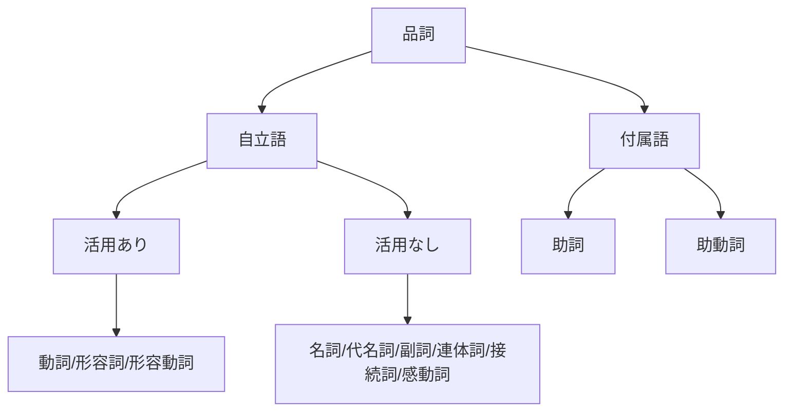
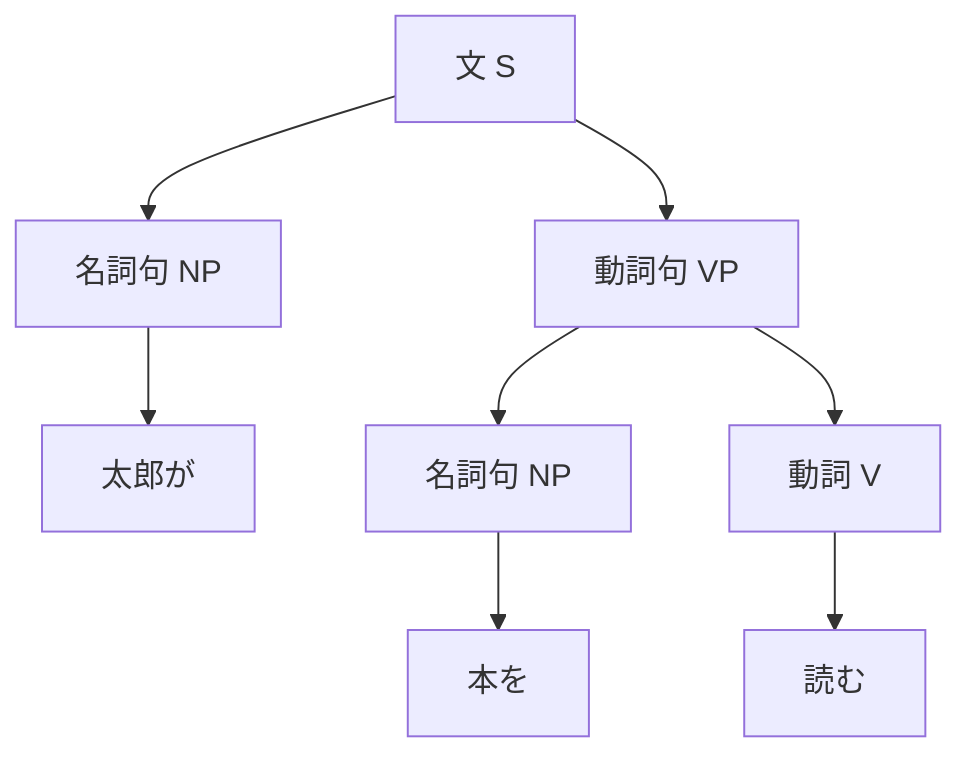

<!-- markdownlint-disable MD003 MD012 MD013 MD022 MD024 MD025 MD033 -->

---
layout: cover
---

# 言語聴覚士国家試験対策
## 言語学 第3週

### 統語論

2025年1月27日（月）2-3限

---
layout: top-title
color: sky
---

:: title ::

# 本日の目標

:: content ::

### 今日覚えるべきキーワード（14個）

1. **統語論** - 文の構造を研究する分野
2. **品詞** - 語の文法的カテゴリー
3. **自立語** - 単独で文節を作れる語
4. **付属語** - 他の語に付属する語
5. **句** - 語が集まった統語的単位
6. **文** - 完結した意味を持つ統語単位
7. **主語** - 動作・状態の主体
8. **述語** - 文の中心的な叙述
9. **目的語** - 動作の対象
10. **修飾語** - 他の語を詳しく説明
11. **句構造** - 句の階層的組織
12. **格** - 名詞と述語の文法関係
13. **語順** - 語の配列順序
14. **統語的曖昧性** - 複数の構造解釈が可能

---
layout: default
---

# 1. 統語論とは

### 統語論（Syntax）の定義
文の構造と語の配列規則を研究する言語学の分野

### 研究対象
- 品詞の分類
- 句の構造
- 文法関係（主語・目的語など）
- 語順の規則
- 文の生成規則

### 臨床との関連
- **失文法**：統語構造の障害
- **失語症**：文産出の困難
- **言語発達障害**：文法獲得の遅れ
- **構音障害**：統語的複雑さの影響

---
layout: default
---

# 2. 日本語の品詞（1）：概観

### 品詞の分類基準
- **意味**：何を表すか
- **形態**：活用の有無
- **機能**：文中での働き

### 大分類



---
layout: default
---

# 2. 日本語の品詞（2）：自立語

### 活用する自立語

| 品詞 | 特徴 | 例 |
|------|------|-----|
| **動詞** | 動作・作用を表す、活用する、述語になる | 走る、食べる、来る |
| **形容詞** | 性質・状態を表す、「-い」で終わる | 赤い、美しい、高い |
| **形容動詞** | 性質・状態を表す、「だ」で終わる | 静かだ、便利だ、元気だ |

### 活用しない自立語

| 品詞 | 特徴 | 例 |
|------|------|-----|
| **名詞** | 事物・概念を表す | 本、学校、愛 |
| **副詞** | 用言を修飾 | ゆっくり、とても、必ず |
| **連体詞** | 体言のみを修飾 | この、あの、大きな |

---
layout: default
---

# 2. 日本語の品詞（3）：付属語

### 助詞の種類

| 種類 | 機能 | 例 |
|------|------|-----|
| **格助詞** | 格関係を示す | が、を、に、で、と |
| **接続助詞** | 文や節を接続 | が、けれど、ので、から |
| **副助詞** | 意味を添える | は、も、さえ、まで |
| **終助詞** | 文末で語気を示す | か、ね、よ、な |

### 助動詞
- 動詞や形容詞に付いて意味を添える
- 例：れる・られる（受身、可能）、た（過去）、ない（否定）

---
layout: default
---

# 3. 文の成分

### 主要な文の成分

#### 主語（Subject）
- 動作・状態の主体
- 「〜が」「〜は」で示される
- 例：**太郎が**本を読む

#### 述語（Predicate）
- 文の中心的叙述
- 文末に位置
- 例：太郎が本を**読む**

#### 目的語（Object）
- 動作の対象
- 「〜を」で示されることが多い
- 例：太郎が**本を**読む

#### 修飾語（Modifier）
- 他の語を詳しく説明
- 例：太郎が**大きな**本を読む
- 例：太郎が本を**ゆっくり**読む

---
layout: default
---

# 4. 格（Case）

### 格助詞と文法関係

日本語では**格助詞**が名詞の文法的役割を示す

| 格助詞 | 格 | 役割 | 例 |
|--------|-----|------|-----|
| が | 主格 | 動作主・主語 | 太郎**が**走る |
| を | 対格 | 動作の対象 | 本**を**読む |
| に | 与格/到格 | 相手・着点 | 友達**に**会う、学校**に**行く |
| で | 処格 | 場所・手段 | 公園**で**遊ぶ、バス**で**行く |
| から | 奪格 | 起点 | 駅**から**歩く |
| と | 共格 | 相手・比較 | 友達**と**話す |

---
layout: default
---

# 5. 日本語の語順

### 基本語順：SOV型

日本語は**SOV言語**（主語-目的語-動詞）

```
太郎が  本を   読む
(S)    (O)    (V)
主語   目的語  動詞
```

### 語順の特徴
- **述語が文末**に来る（head-final）
- 比較的**自由な語順**
  - 「太郎が本を読む」≈「本を太郎が読む」
- 助詞があるため語順が柔軟
- ただし、述語は通常文末に固定

---
layout: default
---

# 6. 句構造（1）

### 句（Phrase）の定義
複数の語が集まって一つのまとまりを作る統語単位

### 主な句の種類

| 句の種類 | 中心語 | 例 |
|----------|--------|-----|
| **名詞句（NP）** | 名詞 | **大きな本** |
| **動詞句（VP）** | 動詞 | **本を読む** |
| **形容詞句（AdjP）** | 形容詞 | **とても赤い** |
| **副詞句（AdvP）** | 副詞 | **とてもゆっくり** |
| **前置詞句（PP）** | 前置詞 | ※日本語は後置詞 |

---
layout: default
---

# 6. 句構造（2）：階層性

### 文の階層構造



**構造**：[S [NP 太郎が] [VP [NP 本を] [V 読む]]]

### 重要ポイント 📌
文は平坦な語の並びではなく、**階層的な構造**を持つ

---
layout: default
---

# 7. 修飾関係

### 連体修飾（名詞を修飾）

#### 形容詞による修飾
- **赤い**花
- **美しい**景色

#### 名詞による修飾
- **日本**の文化
- **昨日**の出来事

#### 連体詞による修飾
- **大きな**建物
- **この**本

#### 文による修飾（関係節）
- **太郎が読んだ**本
- **花が咲いている**庭

### 連用修飾（用言を修飾）
- 副詞：**ゆっくり**歩く
- 副詞句：**図書館で**勉強する

---
layout: default
---

# 8. 統語的曖昧性

### 一つの文に複数の構造解釈が可能

#### 例1：「古い本と雑誌」

**解釈A**：[古い [本と雑誌]]
- 本も雑誌も古い

**解釈B**：[[古い本] と 雑誌]
- 本だけが古い

#### 例2：「太郎と花子が結婚した」

**解釈A**：太郎と花子が**互いに**結婚した

**解釈B**：太郎と花子が**それぞれ別の人と**結婚した

---
layout: default
---

# 9. 文の種類

### 文型による分類

| 文型 | 特徴 | 例 |
|------|------|-----|
| **平叙文** | 事実を述べる | 太郎が走る |
| **疑問文** | 質問する | 太郎が走るか |
| **命令文** | 命令・依頼 | 走れ／走りなさい |
| **感嘆文** | 驚き・感動 | なんと速いことか |

### 単文と複文

- **単文**：一つの述語を持つ文
  - 「太郎が走る」
- **複文**：複数の述語を持つ文
  - 「太郎が走って、花子が笑った」（並列）
  - 「太郎が走ったので、疲れた」（従属）

---
layout: section
color: amber
---

# 休憩

### 後半は口頭試問で知識を定着させます

---
layout: default
---

# 問題1：品詞の識別

### 次の文の下線部「赤い」の品詞は何か。

**「赤い花が咲いている」**

1. 名詞
2. 動詞
3. 形容詞
4. 形容動詞
5. 連体詞

---
layout: default
color: green
---

# 問題1：解答と解説

### 正解：3（形容詞）

#### 解説

**「赤い」の特徴：**
- 性質・状態を表す
- 「-い」で終わる
- 活用する（赤い、赤く、赤かった）
- 名詞「花」を修飾している

#### 形容詞 vs 形容動詞
- **形容詞**：「-い」で終わる（赤い、高い、美しい）
- **形容動詞**：「-だ」で終わる（静かだ、元気だ）

#### 形容詞 vs 連体詞
- **形容詞**：活用する
- **連体詞**：活用しない（大きな、この、あの）

---
layout: default
---

# 問題2：文の成分

### 次の文で「本を」が果たしている文法的役割は何か。

**「太郎が図書館で本を読んだ」**

1. 主語
2. 述語
3. 目的語
4. 補語
5. 修飾語

---
layout: default
color: green
---

# 問題2：解答と解説

### 正解：3（目的語）

#### 解説

文の構造分析：
```
太郎が    図書館で   本を     読んだ
(主語)   (修飾語)  (目的語)  (述語)
```

- **「本を」**：動詞「読む」の動作の対象 → 目的語
- 格助詞「を」が目的語を示す

#### 各成分の役割
- **主語「太郎が」**：動作の主体
- **修飾語「図書館で」**：場所を示す
- **目的語「本を」**：動作の対象
- **述語「読んだ」**：文の中心的叙述

---
layout: default
---

# 問題3：格助詞

### 次の文で「に」が表す格関係として最も適切なものはどれか。

**「友達に手紙を書く」**

1. 主格
2. 対格
3. 与格（相手）
4. 処格（場所）
5. 奪格（起点）

---
layout: default
color: green
---

# 問題3：解答と解説

### 正解：3（与格）

#### 解説

**「友達に」**：動作の相手を示す与格

#### 格助詞「に」の用法

| 用法 | 例 | 意味 |
|------|-----|------|
| **与格（相手）** | 友達**に**会う | 動作の相手 |
| **到格（着点）** | 学校**に**行く | 動作の到達点 |
| **時間** | 3時**に**起きる | 時点 |
| **目的** | 買い物**に**行く | 行為の目的 |

#### 類似する格助詞
- **を**：対格（動作の対象）「本**を**読む」
- **で**：処格（場所・手段）「公園**で**遊ぶ」

---
layout: default
---

# 問題4：語順

### 日本語の基本語順として正しいものはどれか。

1. SVO（主語-動詞-目的語）
2. SOV（主語-目的語-動詞）
3. VSO（動詞-主語-目的語）
4. 語順は完全に自由
5. 日本語に語順の規則はない

---
layout: default
color: green
---

# 問題4：解答と解説

### 正解：2（SOV）

#### 解説

日本語は**SOV言語**

```
太郎が  本を   読む
(S)    (O)    (V)
主語   目的語  動詞
```

#### 世界の言語の語順
- **SOV型**：日本語、韓国語、トルコ語
- **SVO型**：英語、中国語、フランス語
- **VSO型**：アイルランド語、アラビア語

#### 日本語の語順の特徴
- 述語が文末に来る（head-final）
- 比較的柔軟（助詞があるため）
- ただし、述語の位置は固定的

---
layout: default
---

# 問題5：句構造

### 次の文の句構造として正しいものはどれか。

**「大きな本」**

1. [動詞句 大きな本]
2. [名詞句 大きな本]
3. [形容詞句 大きな本]
4. [副詞句 大きな本]
5. 句ではなく単なる語の並び

---
layout: default
color: green
---

# 問題5：解答と解説

### 正解：2（名詞句）

#### 解説

**「大きな本」**の構造：

```
[名詞句 [連体詞 大きな] [名詞 本]]
```

- **中心語**：「本」（名詞）
- **修飾語**：「大きな」（連体詞）
- 中心語が名詞なので、全体として**名詞句**

#### 句の種類の見分け方
句の種類は**中心語（head）**の品詞で決まる

- 中心語が名詞 → 名詞句
- 中心語が動詞 → 動詞句
- 中心語が形容詞 → 形容詞句

---
layout: default
---

# 問題6：修飾関係

### 次の文で「ゆっくり」が修飾しているのはどれか。

**「太郎がゆっくり本を読む」**

1. 太郎
2. 本
3. 読む
4. 太郎と本の両方
5. 文全体

---
layout: default
color: green
---

# 問題6：解答と解説

### 正解：3（読む）

#### 解説

**「ゆっくり」**：副詞
- 副詞は**用言（動詞・形容詞）**を修飾
- この文では動詞「読む」を修飾
- 「どのように読むか」を説明

#### 修飾の種類

**連体修飾**（体言を修飾）
- 「**大きな**本」
- 「**赤い**花」

**連用修飾**（用言を修飾）
- 「**ゆっくり**歩く」
- 「**図書館で**勉強する」

---
layout: default
---

# 問題7：統語的曖昧性

### 次の文が持つ曖昧性の説明として正しいものはどれか。

**「古い本と雑誌」**

1. 曖昧性はない
2. 「古い」が「本」だけを修飾するか、「本と雑誌」両方を修飾するか不明
3. 「本」と「雑誌」のどちらが主語か不明
4. 過去か現在かが不明
5. 肯定か否定かが不明

---
layout: default
color: green
---

# 問題7：解答と解説

### 正解：2

#### 解説

**「古い本と雑誌」**の二つの解釈：

**解釈A**：[古い [本と雑誌]]
```
       古い
       ↙  ↘
      本    雑誌
```
→ 本も雑誌も古い

**解釈B**：[[古い本] と 雑誌]
```
     古い
      ↓
      本  と  雑誌
```
→ 本だけが古い

#### 曖昧性の原因
**等位接続**「と」の作用域が不明確

---
layout: default
---

# 問題8：文の種類

### 次のうち、**複文**はどれか。

1. 太郎が走る。
2. 太郎が速く走る。
3. 太郎が走って、花子が笑った。
4. 速い太郎が走る。
5. 太郎は学生だ。

---
layout: default
color: green
---

# 問題8：解答と解説

### 正解：3

#### 解説

**複文の定義**：複数の述語を持つ文

**3. 「太郎が走って、花子が笑った」**
- 述語1：「走って」
- 述語2：「笑った」
- 二つの節が並列的に接続

#### 単文（その他の選択肢）
- **1**：述語は「走る」のみ
- **2**：述語は「走る」のみ（「速く」は副詞）
- **4**：述語は「走る」のみ（「速い」は連体修飾）
- **5**：述語は「だ」のみ

---
layout: default
---

# 追加演習問題

### ※ここに実際の国家試験過去問を追加してください

#### 準備事項
1. 厚生労働省または試験実施機関から過去問を入手
2. 言語学（統語論）に関する問題を抽出
3. 問題番号、出題回、選択肢をこのスライドに追加

#### 推奨する過去問の範囲
- 第20回〜第27回言語聴覚士国家試験
- 品詞、文の成分に関する問題
- 格、語順に関する問題
- 句構造に関する問題

---
layout: top-title
---

:: title ::

# 本日のまとめ

:: content ::

### 確認：今日覚えたキーワード14個

1. ✅ 統語論
2. ✅ 品詞
3. ✅ 自立語
4. ✅ 付属語
5. ✅ 句
6. ✅ 文
7. ✅ 主語
8. ✅ 述語
9. ✅ 目的語
10. ✅ 修飾語
11. ✅ 句構造
12. ✅ 格
13. ✅ 語順
14. ✅ 統語的曖昧性

### 次週の予告
**第4週（2/3）：意味論・語用論と総合演習**
- 語の意味関係
- 文の意味
- 語用論の基礎
- 全範囲の総復習

---
layout: end
---

# お疲れ様でした

### 復習のポイント
- 品詞の分類を確実に覚える
- 文の成分の識別練習
- 格助詞の用法を整理
- 日常の文で句構造を分析

次週もよろしくお願いします。
