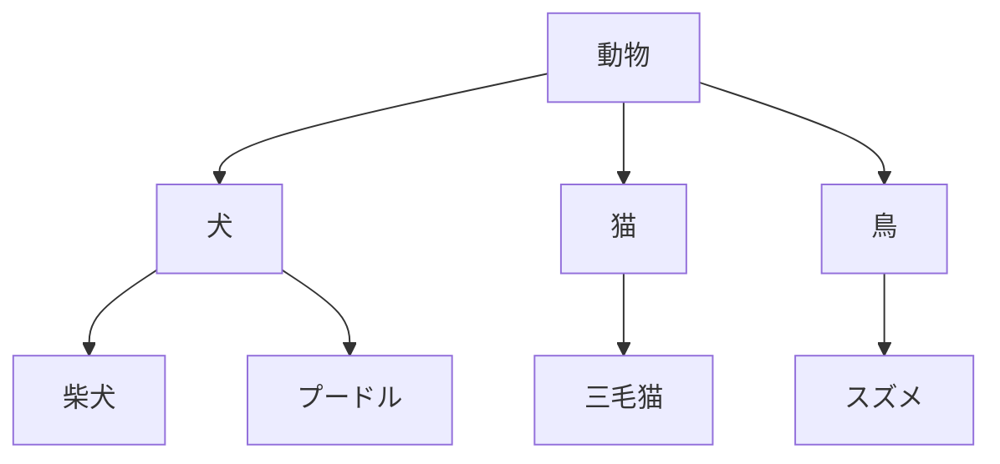

<!-- markdownlint-disable MD003 MD012 MD013 MD022 MD024 MD025 MD033 -->

---
layout: cover
---

# 言語聴覚士国家試験対策
## 言語学 第4週

### 意味論・語用論と総合演習

2025年2月3日（月）2-3限

---
layout: top-title
color: sky
---

:: title ::

# 本日の目標

:: content ::

### 今日覚えるべきキーワード（13個）

1. **意味論** - 語と文の意味を研究する分野
2. **語用論** - 文脈における言語使用を研究
3. **同義語** - 同じ意味を持つ語
4. **反意語** - 反対の意味を持つ語
5. **上位語** - より一般的な概念を表す語
6. **下位語** - より具体的な概念を表す語
7. **多義語** - 複数の関連した意味を持つ語
8. **同音異義語** - 音は同じで意味が異なる語
9. **指示** - 言葉と世界の対象の関係
10. **含意** - 文が論理的に含む意味
11. **前提** - 文が前もって仮定する内容
12. **発話行為** - 言葉による行為
13. **会話の含意** - 会話で暗示される意味

---
layout: default
---

# 1. 意味論とは

### 意味論（Semantics）の定義
語と文の**意味**を研究する言語学の分野

### 研究対象
- 語の意味関係
- 文の真理条件
- 意味の構成性
- 指示と意味の区別

### 臨床との関連
- **失語症**：語彙意味障害
- **認知症**：意味記憶の障害
- **言語発達障害**：語彙発達の遅れ
- 語彙評価・訓練の基礎

---
layout: default
---

# 2. 語彙の意味関係（1）

### 同義語（Synonym）
同じまたは非常に近い意味を持つ語

#### 完全同義語（稀）
- 「始める」と「始る」
- ※実際には微妙な違いがある

#### 部分同義語（多い）
- 「美しい」と「綺麗」
- 「歩く」と「歩む」
- 文脈によって使い分け

### 重要ポイント 📌
完全な同義語は少ない
- 使用域の違い（formal/informal）
- ニュアンスの違い
- 文体の違い

---
layout: default
---

# 2. 語彙の意味関係（2）

### 反意語（Antonym）
反対の意味を持つ語

| 種類 | 特徴 | 例 |
|------|------|-----|
| **対立反意語** | 二者択一、段階なし | 生きている/死んでいる、既婚/未婚 |
| **程度反意語** | 段階的、連続的 | 熱い/冷たい、大きい/小さい |
| **逆方向反意語** | 相互的関係 | 買う/売る、教える/習う |

### 特徴
- 反意語は同じ意味領域に属する
- 一方を否定しても他方を意味するとは限らない
  - 例：「熱くない」≠「冷たい」（温かい、ぬるい等の可能性）

---
layout: default
---

# 2. 語彙の意味関係（3）

### 上位語・下位語（Hyponymy）



- **上位語**：より一般的（動物）
- **下位語**：より具体的（犬、猫）
- **同位語**：同じレベル（犬、猫、鳥）

---
layout: top-title-two-cols
---

:: title ::

# 2. 語彙の意味関係（4）

:: left ::

### 多義語（Polysemy）
一つの語が**関連した複数の意味**を持つ

**例：「頭」**
1. 身体部位：「**頭**が痛い」
2. 知能：「**頭**がいい」
3. 先端：「列の**頭**」
4. リーダー：「組織の**頭**」

→ 中心的意味から拡張

:: right ::

### 同音異義語（Homonym）
音は同じだが**無関係な意味**を持つ

**例：「橋」と「箸」**
- 「橋」：建造物
- 「箸」：食器

**例：「雨」と「飴」**
- 「雨」：天候
- 「飴」：お菓子

→ 偶然の一致

---
layout: default
---

# 3. 文の意味

### 真理条件（Truth Conditions）
文が真となる世界の状態

#### 例：「太郎は学生だ」
- **真理条件**：太郎が学生である状態
- この文は、太郎が実際に学生であれば**真**

### 含意（Entailment）
文Aが真なら文Bも必ず真になる関係

#### 例
- A：「太郎は犬を飼っている」
- B：「太郎は動物を飼っている」
- A → B（Aが真ならBも真）

---
layout: default
---

# 4. 前提（Presupposition）

### 前提の定義
文が前もって仮定している内容

### 例1：「太郎は喫煙をやめた」

**前提**：太郎は以前喫煙していた

- 肯定文：「太郎は喫煙をやめた」
- 否定文：「太郎は喫煙をやめなかった」
- **どちらの場合も前提は保たれる**

### 例2：「太郎の妻は美しい」

**前提**：太郎には妻がいる

---
layout: default
---

# 5. 語用論とは

### 語用論（Pragmatics）の定義
文脈における言語の**使用**を研究する分野

### 意味論との違い
- **意味論**：語や文の意味
  - 「犬」の意味は何か
- **語用論**：文脈での意味
  - 「犬」と言って何を伝えたいか

### 研究対象
- 発話行為
- 会話の含意
- 指示表現
- 丁寧さ
- 会話の原理

---
layout: default
---

# 6. 発話行為（Speech Act）

### J.L. Austinの発話行為理論

| 行為 | 定義 | 例 |
|------|------|-----|
| **発語行為** | 音を発する | 「窓を開けて」と言う |
| **発語内行為** | 何をしているか | 依頼している |
| **発語媒介行為** | 何が起こるか | 相手が窓を開ける |

### 直接発話行為 vs 間接発話行為

- **直接**：「窓を開けてください」（命令形）
- **間接**：「暑いですね」（依頼を含意）

---
layout: default
---

# 7. 会話の含意

### Griceの協調原理と格率

会話は**協調原理**に基づく

### 4つの格率

1. **量の格率**：必要十分な情報を提供
2. **質の格率**：真実を述べる
3. **関係の格率**：関連性のあることを述べる
4. **様態の格率**：明瞭に述べる

### 会話の含意（Implicature）
格率に従っているように見せて、実際には別の意味を伝える

**例**：「太郎は天才だ」（皮肉で言う）
→ 実際は「太郎は愚かだ」を含意

---
layout: default
---

# 8. 指示表現（Deixis）

### 文脈依存的な表現

| 種類 | 説明 | 例 |
|------|------|-----|
| **人称指示** | 話し手・聞き手 | 私、あなた、彼 |
| **時間指示** | 発話時を基準 | 今、昨日、明日 |
| **場所指示** | 発話場所を基準 | ここ、そこ、あそこ |
| **文脈指示** | 談話内の対象 | これ、それ、あれ |

### 特徴
指示対象は**発話状況**によって変わる
- 「明日」が指す日は、いつ言うかで変わる

---
layout: section
color: amber
---

# 休憩

### 後半は総合演習と弱点補強

---
layout: default
---

# 総合演習：分野横断問題

### これまでの学習内容を統合して解く問題に挑戦

#### 対象分野
- 第1週：音韻論
- 第2週：形態論
- 第3週：統語論
- 第4週：意味論・語用論

---
layout: default
---

# 問題1：意味関係

### 次のうち、**反意語**の関係にあるのはどれか。

1. 「美しい」と「綺麗」
2. 「大きい」と「小さい」
3. 「犬」と「柴犬」
4. 「橋」と「箸」
5. 「本」と「雑誌」

---
layout: default
color: green
---

# 問題1：解答と解説

### 正解：2

#### 解説

**2. 「大きい」と「小さい」**
- **程度反意語**（gradable antonyms）
- 連続的な尺度上の対立
- 段階的な差異がある

#### 他の選択肢
- **1**：同義語（類義語）
- **3**：上位語と下位語
- **4**：同音異義語
- **5**：同位語（同じカテゴリーの異なる語）

---
layout: default
---

# 問題2：多義語

### 次のうち、**多義語**の例として正しいものはどれか。

1. 「橋」（建造物）と「箸」（食器）
2. 「頭」（身体部位）と「頭」（リーダー）
3. 「犬」と「猫」
4. 「読む」と「読まない」
5. 「美しい」と「醜い」

---
layout: default
color: green
---

# 問題2：解答と解説

### 正解：2

#### 解説

**「頭」の多義性**：
- 身体部位：「**頭**が痛い」
- 知能：「**頭**がいい」
- リーダー：「組織の**頭**」
- 先端：「列の**頭**」

これらは**関連した意味**を持つ（中心義から拡張）

#### 同音異義語との違い
- **1**：「橋」と「箸」は同音異義語（無関係な意味）
- 多義語は意味の関連性あり
- 同音異義語は偶然の一致

---
layout: default
---

# 問題3：含意

### 「太郎は犬を飼っている」という文が真である場合、必ず真となる文はどれか。

1. 太郎は猫を飼っている
2. 太郎は動物を飼っている
3. 太郎は犬が好きだ
4. 太郎はペットを飼っている
5. 太郎は柴犬を飼っている

---
layout: default
color: green
---

# 問題3：解答と解説

### 正解：2

#### 解説

**含意（Entailment）**：文Aが真ならば文Bも必ず真

```
「太郎は犬を飼っている」
        ↓ 含意
「太郎は動物を飼っている」
```

- 犬は動物の一種（下位語→上位語）
- 下位語が真なら上位語も必ず真

#### 他の選択肢
- **1**：猫を飼っているとは限らない
- **3**：好きかどうかは不明
- **4**：ペットとして飼っているかは不明
- **5**：柴犬とは限らない（プードル等の可能性）

---
layout: default
---

# 問題4：前提

### 「太郎は喫煙をやめた」という文の**前提**として正しいものはどれか。

1. 太郎は現在喫煙している
2. 太郎は以前喫煙していた
3. 太郎は健康だ
4. 太郎は喫煙が嫌いだ
5. 前提はない

---
layout: default
color: green
---

# 問題4：解答と解説

### 正解：2

#### 解説

**前提（Presupposition）**：文が前提としている内容

「太郎は喫煙を**やめた**」
- 「やめた」という動詞は、以前その行為をしていたことを前提とする

#### 前提の特徴
否定文でも前提は保たれる：
- 肯定：「太郎は喫煙をやめた」
- 否定：「太郎は喫煙をやめ**なかった**」
- **どちらも**「太郎は以前喫煙していた」を前提

#### 含意との違い
前提は否定されても残る、含意は否定されると消える

---
layout: default
---

# 問題5：発話行為

### 「暑いですね」と言って相手に窓を開けてもらう場合、これは何という発話行為か。

1. 直接発話行為
2. 間接発話行為
3. 発語行為のみ
4. 発語媒介行為のみ
5. 発話行為ではない

---
layout: default
color: green
---

# 問題5：解答と解説

### 正解：2（間接発話行為）

#### 解説

**「暑いですね」**：
- **字義通りの意味**：気温についての叙述
- **実際の意図**：窓を開けてほしいという依頼

→ 形式と機能が一致しない **間接発話行為**

#### 直接発話行為との比較
- **直接**：「窓を開けてください」（依頼形式で依頼）
- **間接**：「暑いですね」（叙述形式で依頼）

#### 言語聴覚士との関連
語用論的能力の評価・訓練で重要

---
layout: default
---

# 問題6：指示表現

### 次のうち、**時間指示**の例として正しいものはどれか。

1. 私
2. ここ
3. これ
4. 明日
5. 太郎

---
layout: default
color: green
---

# 問題6：解答と解説

### 正解：4

#### 解説

指示表現の分類：

| 種類 | 例 | 基準 |
|------|-----|------|
| **人称指示** | 私、あなた | 話し手・聞き手 |
| **場所指示** | ここ、そこ | 発話場所 |
| **文脈指示** | これ、それ | 談話内の対象 |
| **時間指示** | 今、昨日、**明日** | 発話時 |

- **「明日」**：発話時を基準とした時間指示
- 指示対象は発話状況によって変わる

---
layout: default
---

# 総合問題1：全分野統合

### 次の文を言語学的に分析した場合、正しい説明はどれか。

**「読まなかった」**

1. 形態素は「読ま」「な」「かった」の3つ
2. 音節数は5である
3. 「な」は自由形態素である
4. 「読ま」は名詞である
5. 過去の意味は表されていない

---
layout: default
color: green
---

# 総合問題1：解答と解説

### 正解：1

#### 解説（各選択肢の検討）

1. ✅ **形態素分析**：「読ま」+「な」+「かった」
   - 読ま：動詞語幹
   - な：否定
   - かった：過去

2. ✗ **音節数**：yo-ma-na-ka-tta で**5音節**（正しい）
   
3. ✗ 「な」は**拘束形態素**（単独で使えない）

4. ✗ 「読ま」は**動詞語幹**

5. ✗ 「かった」で**過去**を表す

---
layout: default
---

# 総合問題2：臨床応用

### ブローカ失語の患者が産出する可能性が高い発話はどれか。

1. 「私が本を読む」
2. 「本 読む」
3. 「読みます本を私が」
4. 「私が読みます」
5. 正常な発話と変わらない

---
layout: default
color: green
---

# 総合問題2：解答と解説

### 正解：2

#### 解説

**ブローカ失語の言語特徴**：

- **文法的形態素の脱落**
  - 助詞「が」「を」の省略
  - 助動詞の省略
  
- **語彙的形態素は保たれる**
  - 名詞「本」、動詞「読む」は産出可能

- **電報文様の発話**
  - 「本 読む」のように最小限の語のみ

#### 言語学との関連
- 語彙的形態素と文法的形態素の分離
- 統語処理の障害
- 音韻・語彙処理は比較的保たれる

---
layout: default
---

# 追加演習問題

### ※ここに実際の国家試験過去問を追加してください

#### 準備事項
1. 厚生労働省または試験実施機関から過去問を入手
2. 言語学（意味論・語用論）に関する問題を抽出
3. 全分野の総合問題も含める
4. 問題番号、出題回、選択肢をこのスライドに追加

#### 推奨する過去問の範囲
- 第20回〜第27回言語聴覚士国家試験
- 意味関係（同義語・反意語等）に関する問題
- 発話行為、語用論に関する問題
- 全分野統合問題

---
layout: default
---

# 弱点補強セッション

### これまでの学習で理解が不十分だった内容を重点的に復習

#### 進め方
1. 各自で理解が不十分な分野を確認
2. 質問・疑問点を挙げる
3. 重点的に解説と演習
4. 仲間同士で教え合う

---
layout: default
---

# 国家試験に向けて

### 試験対策のポイント

### 学習方法
- **キーワードの暗記**
  - 定義を正確に
  - 具体例とセットで
  
- **過去問演習**
  - 繰り返し解く
  - 間違いから学ぶ

- **体系的理解**
  - 分野間の関連を把握
  - 全体像を意識

### 試験直前
- **頻出分野の確認**
  - 形態素、品詞
  - 音韻規則
  - 意味関係

- **弱点の最終チェック**

- **基本に立ち返る**
  - 定義の確認
  - 基本例の復習

---
layout: default
---

# 全4週のまとめ

### 学習した主要分野

| 週 | テーマ | 主要キーワード |
|-----|--------|-------------|
| **第1週** | 音韻論 | 音素、異音、音韻規則、二重分節 |
| **第2週** | 形態論 | 形態素、派生、複合、活用 |
| **第3週** | 統語論 | 品詞、句構造、格、語順 |
| **第4週** | 意味・語用論 | 意味関係、含意、発話行為 |

### 総キーワード数：54個
すべてのキーワードを確実に理解し、説明できるようにする

---
layout: default
---

# 最終確認テスト（セルフチェック）

### 以下の質問に答えられますか？

1. 音素と異音の違いを説明できるか？
2. 形態素の種類を挙げられるか？
3. 屈折と派生の違いを説明できるか？
4. 日本語の基本語順を答えられるか？
5. 品詞を分類できるか？
6. 文の成分（主語・述語等）を識別できるか？
7. 同義語と反意語の違いを説明できるか？
8. 多義語と同音異義語の違いを説明できるか？
9. 含意と前提の違いを説明できるか？
10. 直接発話行為と間接発話行為の違いを説明できるか？

---
layout: top-title
---

:: title ::

# 本日のまとめ

:: content ::

### 確認：今日覚えたキーワード13個

1. ✅ 意味論
2. ✅ 語用論
3. ✅ 同義語
4. ✅ 反意語
5. ✅ 上位語
6. ✅ 下位語
7. ✅ 多義語
8. ✅ 同音異義語
9. ✅ 指示
10. ✅ 含意
11. ✅ 前提
12. ✅ 発話行為
13. ✅ 会話の含意

### 全4週を通して学んだこと
- 言語学の基礎体系
- 言語の各レベル（音韻・形態・統語・意味）
- 臨床への応用可能性

---
layout: default
---

# 国家試験合格に向けて

### 最後のメッセージ

1. **基本の徹底**
   - 定義とキーワードを確実に
   
2. **過去問の反復**
   - パターンを掴む
   
3. **体系的理解**
   - 点ではなく線で理解

4. **自信を持つ**
   - 準備してきたことを信じる

---
layout: end
---

# 8コマの授業、お疲れ様でした

### 国家試験、応援しています！

#### 復習のための資料
- 各週のスライドを見返す
- キーワードリストを作成
- 過去問を繰り返し解く

#### 質問・相談
試験までに不明点があれば、いつでも連絡してください。

### 皆さんの合格を心から祈っています 🎓
